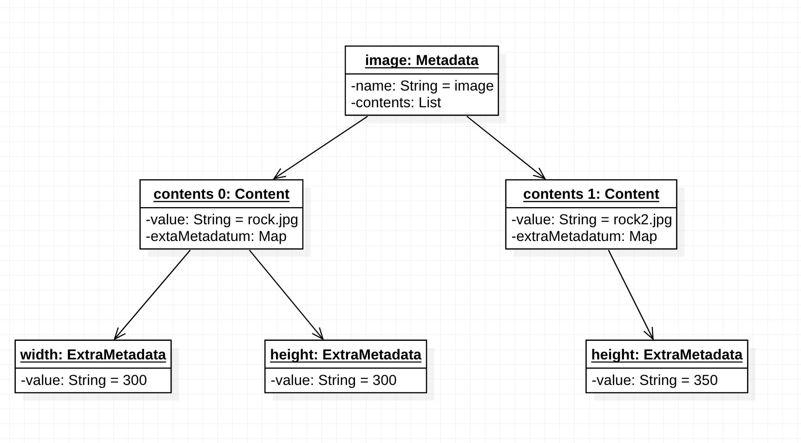
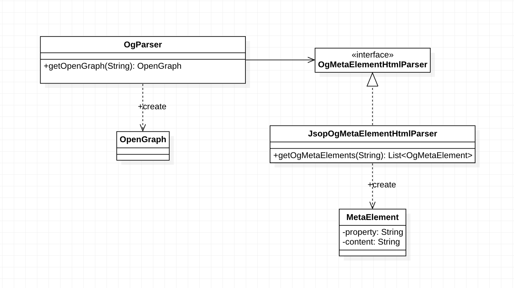

# ogparser4j

## Usage
### How to Get OpenGraph object from your target url. 
```
OgParser ogParser = new OgParser();
OpenGraph openGraph = ogParser.getOpenGraph("https://target.url");
```

### How to Get OpenGraph Value
- sample meta elements
```
<meta property="og:title" content="Open Graph protocol" />
```

- usage
```
OpenGraph.Content title = openGraph.getContent("title");
String titleValue = title.getValue(); // "Open Graph protocol"
```

### How to Get Extra Data
- sample meta elements
```
<meta property="og:image" content="https://ogp.me/logo.png" />
<meta property="og:image:type" content="image/png" />
```

- usage
```
OpenGraph.Content image = openGraph.getContent("image");
String imageType = image.getExtraDataValue("type"); // "image/png"
```

### How to Get Array Values
- sample meta elements(1)
```
<meta property="og:image" content="https://ogp.me/logo.png" />
<meta property="og:image" content="https://ogp.me/logo2.png" />
```

- usage(1)
```
OpenGraph.Content imageIndex0 = openGraph.getContent("image", 0); // you can omit index 0.
OpenGraph.Content imageIndex1 = openGraph.getContent("image", 1);

String image0 = imageIndex0.getValue(); // "https://ogp.me/logo.png"
String image1 = imageIndex1.getValue(); // "https://ogp.me/logo2.png"
```

- sample meta elements(2)
```
<meta property="og:image" content="https://ogp.me/logo.png" />
<meta property="og:image:width" content="300" />
<meta property="og:image" content="https://ogp.me/logo2.png" />
<meta property="og:image:width" content="200" />
```

- usage(2)
```
OpenGraph.Content imageIndex0 = openGraph.getContent("image", 0); // you can omit index 0.
OpenGraph.Content imageIndex1 = openGraph.getContent("image", 1);

String image0Width = imageIndex0.getExtraDataValue("width"); // "300"
String image1Wdith = imageIndex1.getExtraDataValue("width); // "200"
```

## Open Graph Protocol Summary
1. It is located in the `<meta>` tags in the `<head>` of HTML.
2. It has two attributes. `property` and `content`.
    - The value of `property`, which is referred to as `metadata`, must start with `og:`.
    ```
    <head>
    ...
    <meta property="og:title" content="The Rock" />
    ...
    </head>
    ```

3. List of Metadata
    - Basic Metadata
        - og:title
        - og:type
        - og:image
        - og:url
    - Optional Metadata
        - og:audio
        - og:description
        - og:determiner
        - og:locale
        - og:locale:alternate
        - og:site_name
        - og:video

4. Some `properties` can have extra `metadata` attached to them. These are specified in the same way as other metadata with property and content, but the property will have extra `:`.
    ```
    <meta property="og:image" content="https://example.com/ogp.jpg" />
    <meta property="og:image:secure_url" content="https://secure.example.com/ogp.jpg" />
    <meta property="og:image:type" content="image/jpeg" />
    <meta property="og:image:width" content="400" />
    <meta property="og:image:height" content="300" />
    <meta property="og:image:alt" content="A shiny red apple with a bite taken out" />
    ```

5. If the same `metadata` is declared multiple times, it is treated as an array. The first tag (from top to bottom) is given preference during conflicts.
    ```
    <meta property="og:image" content="https://example.com/rock.jpg" />
    <meta property="og:image" content="https://example.com/rock2.jpg" />
    ```
    
    ```
    <meta property="og:image" content="https://example.com/rock.jpg" />
    <meta property="og:image:width" content="300" />
    <meta property="og:image:height" content="300" />
    <meta property="og:image" content="https://example.com/rock2.jpg" />
    <meta property="og:image" content="https://example.com/rock3.jpg" />
    <meta property="og:image:height" content="1000" />
    ```
- It means there are 3 images on this page, the first image is 300x300, the middle one has unspecified dimensions, and the last one is 1000px tall.

### Reference
- https://ogp.me/

## Object Structure
```
<meta property="og:image" content="rock.jpg" />
<meta property="og:image:width" content="300" />
<meta property="og:image:height" content="300" />
<meta property="og:image" content="rock2.jpg" />
<meta property="og:image:height" content="350" />
```



## Class Diagram

