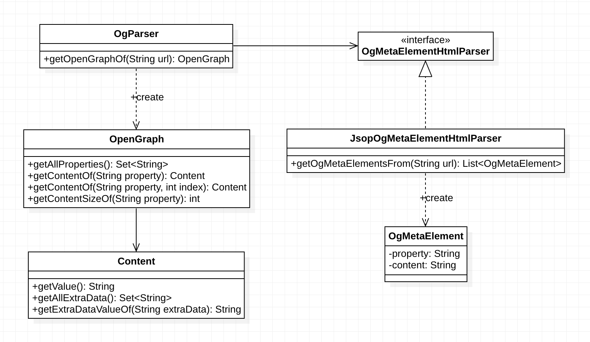

# ogparser4j
- This is OpenGraph parser for Java.
## Installation
1. maven
```
<dependency>
  <groupId>com.github.siyoon210</groupId>
  <artifactId>ogparser4j</artifactId>
  <version>1.0.1</version>
</dependency>
```

2. gradle
```
implementation 'com.github.siyoon210:ogparser4j:1.0.1'
```

[Maven Cetral : ogparser4j](https://search.maven.org/search?q=a:ogparser4j)

## Usage
### How to Get OpenGraph object from your target url. 
```java
OgParser ogParser = new OgParser();
OpenGraph openGraph = ogParser.getOpenGraphOf("https://target.url");
```

### How to Get OpenGraph Value
- sample meta elements
```html
<meta property="og:title" content="Open Graph protocol" />
```

- usage
```java
OpenGraph.Content title = openGraph.getContentOf("title");
String titleValue = title.getValue(); // "Open Graph protocol"
```

### How to Get Extra Data
- sample meta elements
```html
<meta property="og:image" content="https://ogp.me/logo.png" />
<meta property="og:image:type" content="image/png" />
```

- usage
```java
OpenGraph.Content image = openGraph.getContentOf("image");
String imageType = image.getExtraDataValueOf("type"); // "image/png"
```

### How to Get Array Values
- sample meta elements(1)
```html
<meta property="og:image" content="https://ogp.me/logo.png" />
<meta property="og:image" content="https://ogp.me/logo2.png" />
```

- usage(1)
```java
OpenGraph.Content imageIndex0 = openGraph.getContentOf("image", 0); // you can omit index 0.
OpenGraph.Content imageIndex1 = openGraph.getContentOf("image", 1);

String image0 = imageIndex0.getValue(); // "https://ogp.me/logo.png"
String image1 = imageIndex1.getValue(); // "https://ogp.me/logo2.png"
```

---

- sample meta elements(2)
```html
<meta property="og:image" content="https://ogp.me/logo.png" />
<meta property="og:image:width" content="300" />
<meta property="og:image" content="https://ogp.me/logo2.png" />
<meta property="og:image:width" content="200" />
```

- usage(2)
```java
OpenGraph.Content imageIndex0 = openGraph.getContentOf("image", 0); // you can omit index 0.
OpenGraph.Content imageIndex1 = openGraph.getContentOf("image", 1);

String image0Width = imageIndex0.getExtraDataValueOf("width"); // "300"
String image1Wdith = imageIndex1.getExtraDataValueOf("width); // "200"
```

## OpenGraph Protocol Summary
[OpenGraph Protocol Summary](./docs/OpenGraph-Protocol-Summary.md)

## Class Diagram

